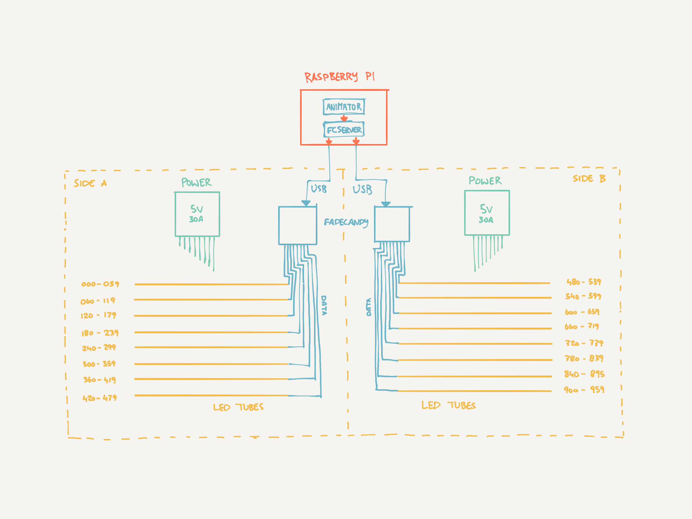

# Lounge LED Light Effects
This project contains the code to control the LED strips in our Lounge. See how we built them (and how pretty they are) [in our blog post (Dutch)](https://digitalartlab.nl/blog/1625-allemaal-lichtjes).

## Software
### Animator
The JavaScript project that generates the patterns for all 960 LEDs in our strips (yes, we control them per pixel. It's very fancy). Each effect is an individual JS file. We're working on organising the project a bit better to make it easier to switch and control the effects. To be continued for sure.

### Fadecandy Server (fcserver)
The software for our controller boards. We use two Fadecandy controllers, each controlling 8 strips of 60 LEDs each. They're connected to a Raspberry Pi with USB. You input OPC commands and the server automagically turns it into almost 1000 sparkling lights.

The `server.json` file contains the config for our specific set-up, like the two controllers and strips with a length of 60 pixels.

## Hardware
### Fadecandy controllers
These tiny dedicated controller boards control the data signal for eight LED strips. It does some special magic, like tone mapping and dithering, and ensures the timing of the data signal lines up perfectly with the needs of the LED strips. The board has a dedicated output for each strip, which is mapped in the Fadecandy Server.

### LED strips
We use WS2811 LED strips that are connected to Fadecandy controller boards. Each strip has 60 LEDs and we have 16 strips in total. That makes for a **total of 960 RGB LEDs**.

### Power supplies
> **Warning!** This design uses high amperage, which can cause *severe injuries or death* when not handled properly. Electricity is not a toy, so make sure you know what you're doing, or get help from someone who does. And (obviously) never work on a live circuit.

We use a dedicated power supply for each 'side' of the bars. Our strips use 5V and the maximum draw of each side is 30A. So, that's a 150W PSU on each side for 300W in total. Keep in mind you'll hardly ever really draw that much power: it only happens when you're on full white for all strips (and that's just boring).

## Architecture overview

## Deploying
We use Balena to release new versions of this project. That means that deployment (for now) is only possible if you have access to the Balena project.

If you do, it's pretty simple: run `balena push dal-lounge-lights` and wait for the unicorn to show up.

## Contributing
**These LED strips are yours to play with too!** See [CONTRIBUTING](CONTRIBUTING.md) for all the information you need to shine your light. Okay, we'll stop the puns now.

## License
MIT

## Thanks
This project wouldn't be possible without the amazing open source Fadecandy project. Read more about it on [their GitHub repo](https://github.com/scanlime/fadecandy).
